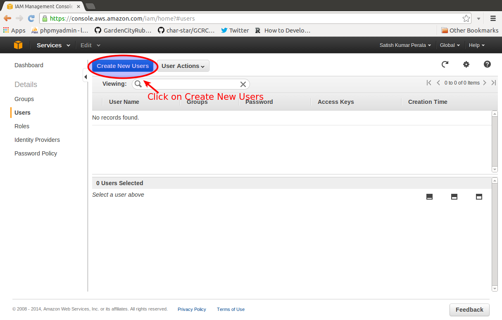
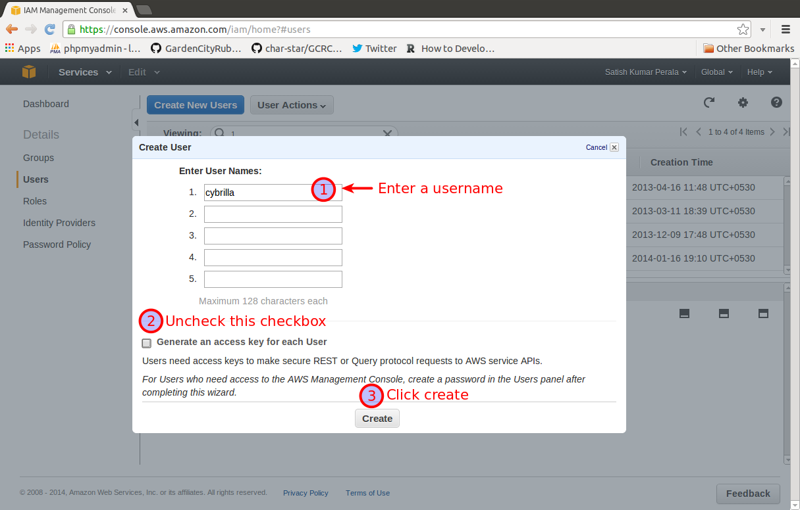
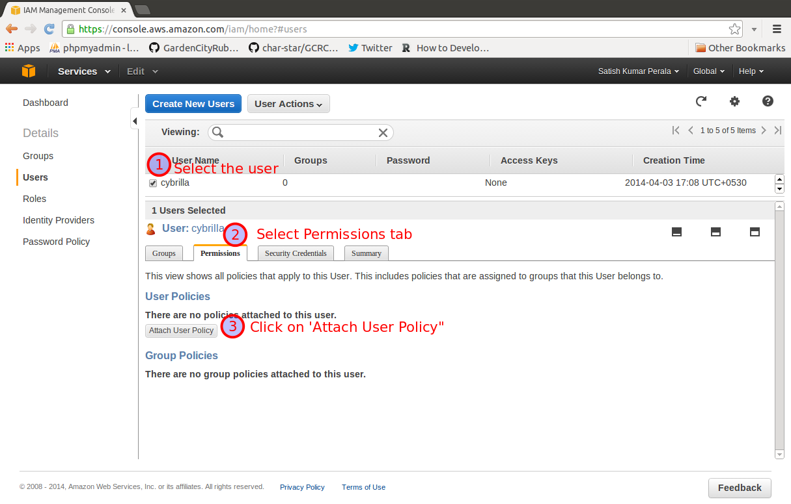
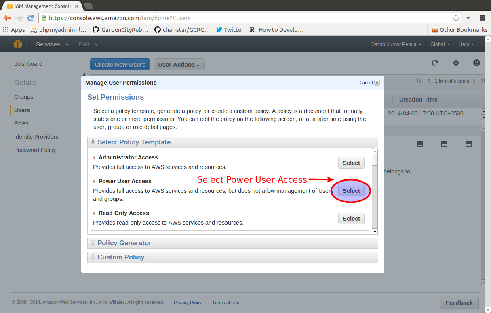
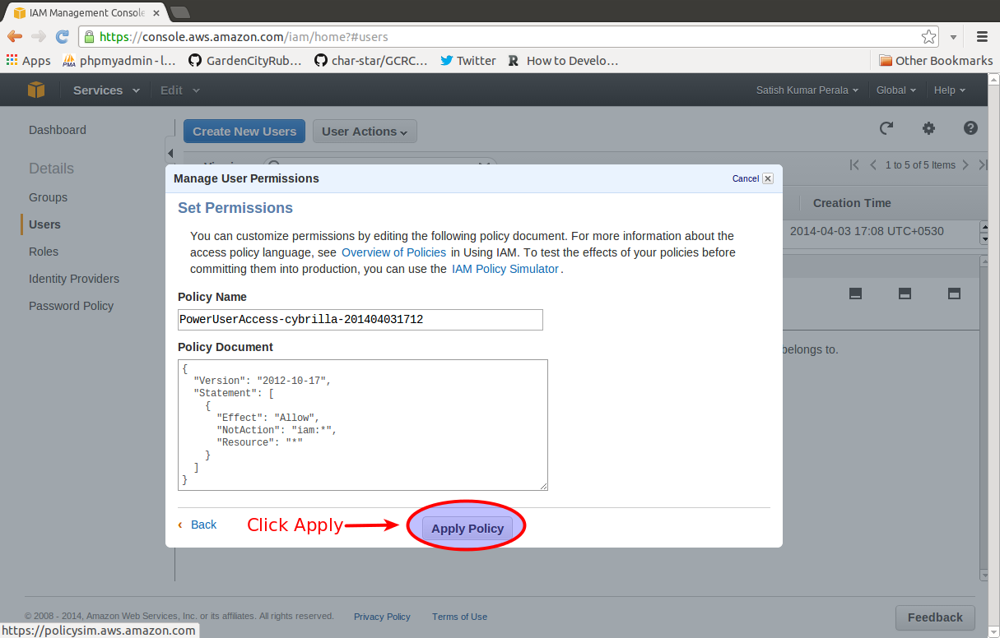
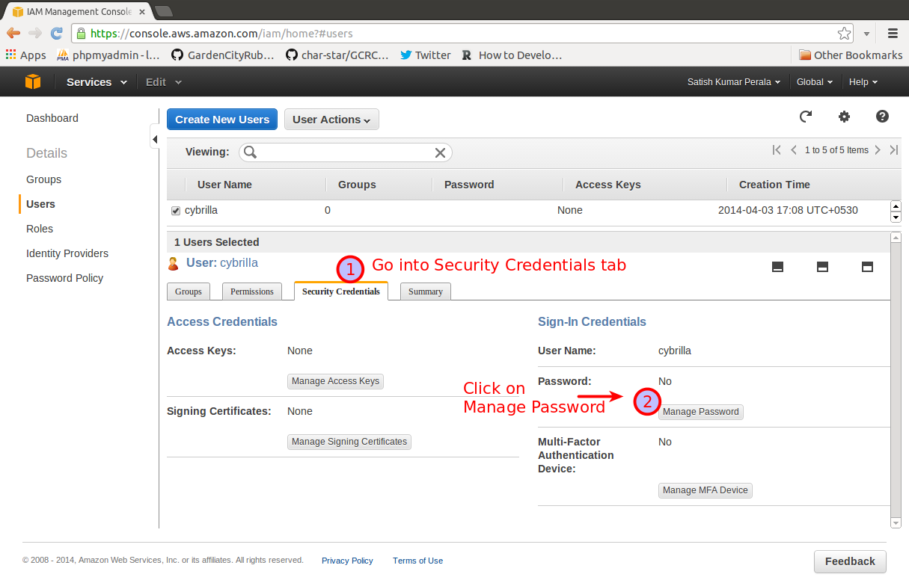
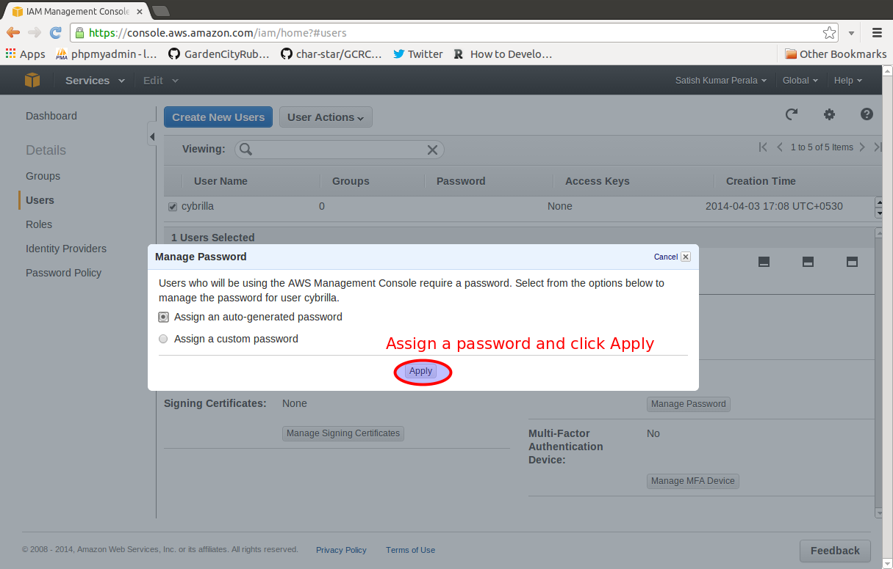
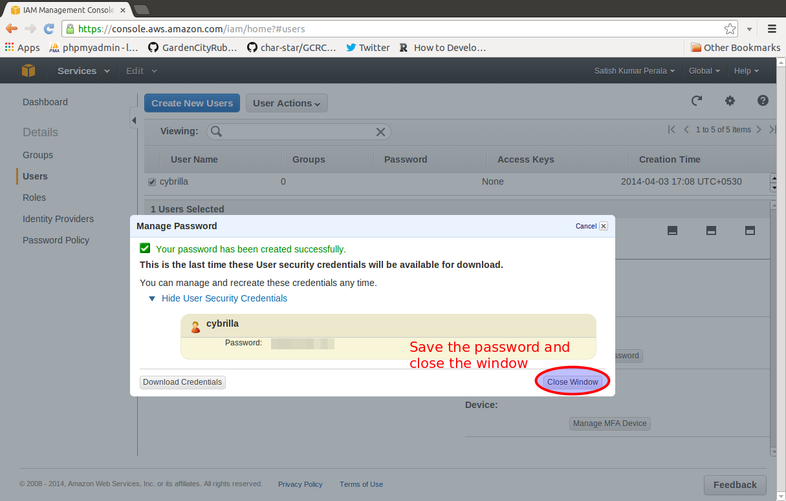

Setting up and AWS IAM user
==========================

Step1
-----

Step2
-----

Step3
-----

Step4
-----

Step5
-----

Step6
-----

Step7
-----

Step8
-----

Step9
-----

Step10
-----

Step11
-----

Send the following details to your development team
--------------------------------------------------
* IAM username
* IAM user password
* Account SignIn URL
