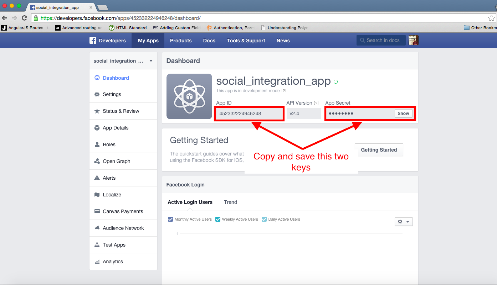
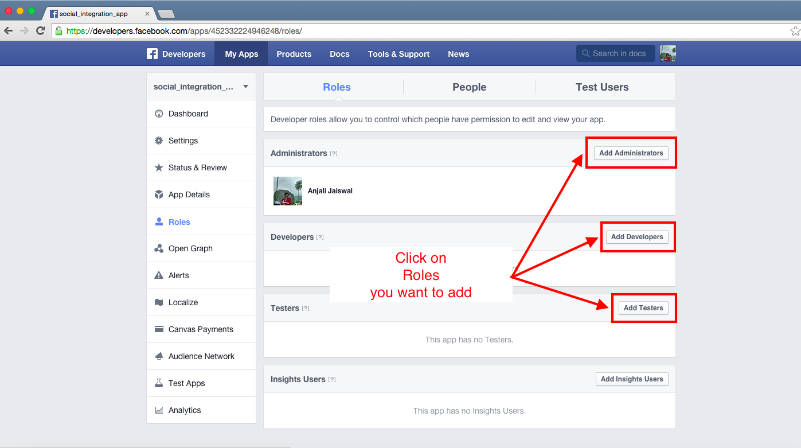
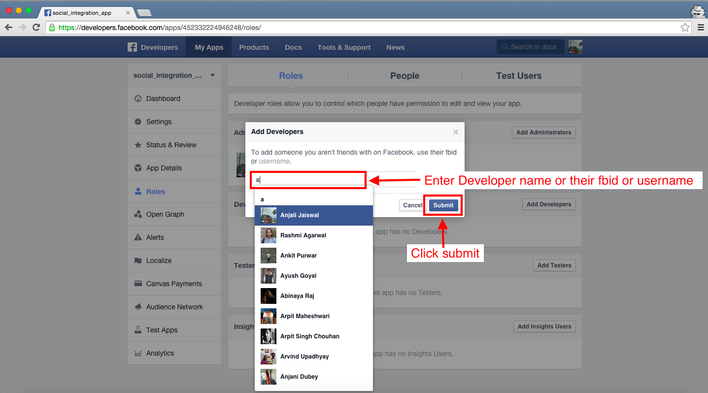
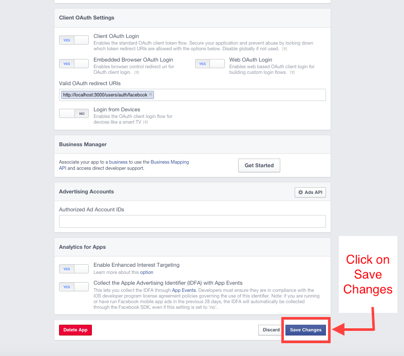

Register your app with Facebook:
================================

Log into your account. Then follow:

Step1 : Create an Application
-----

Step2 : Enter all details & submit
-----

Step3 : Pass security check
-----

Step4 : Get Client ID & Client Secret
-----

Step5 : Go to Settings Tab
-----

Step6 : Go to Advanced Tab
-----

Step7 : Enable Embedded Browser OAuth Login & Enter Valid OAuth redirect URIs
-----

Step8 : Save Changes
-----

And finally ... 
--------------------------------------------------
Send the following details to your development team

* App ID
* App Secret