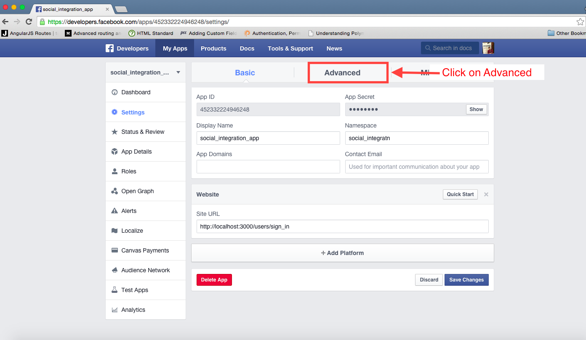
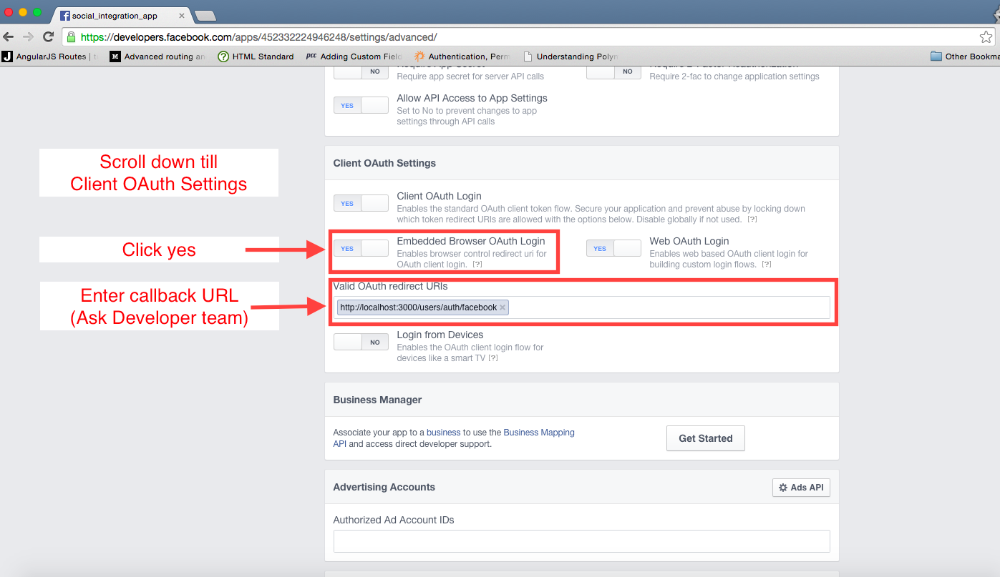

Register your app with Facebook:
================================

Log into your account. Then follow:

Step1 : Create an Application
-----

Step2 : Enter all details & submit
-----

Step3 : Pass security check
-----

Step4 : Get Client ID & Client Secret
-----

If you add a developer you don't have to follow through step 8 - step 11.
If you don't want a developer jump to step 8 directly.

Step5 : Assign Roles

Step6 : Choose Role

Step7 : Add Developer

Step8 : Go to Settings Tab
-----

Step9 : Go to Advanced Tab
-----

Step10 : Enable Embedded Browser OAuth Login & Enter Valid OAuth redirect URIs
-----

Step11 : Save Changes
-----

And finally ... 
--------------------------------------------------
Send the following details to your development team

* App ID
* App Secret