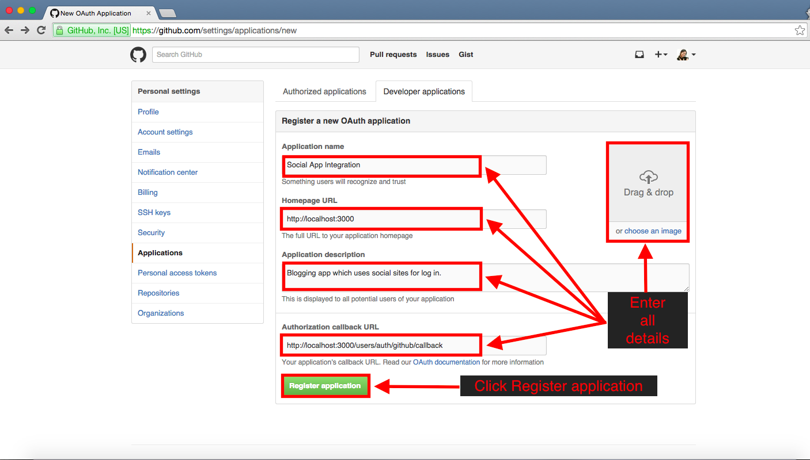
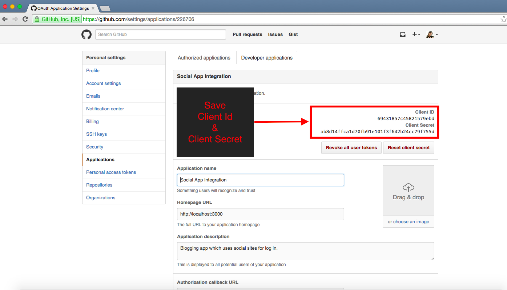

Register your app with github:
================================

Log into your account. Then follow:

Step1 : Register New Application
-----

Step2 : Enter all details & register
-----

Step3 : Get Client ID & Client Secret
-----

And finally ... 
--------------------------------------------------
Send the following details to your development team

* Client ID
* Client Secret