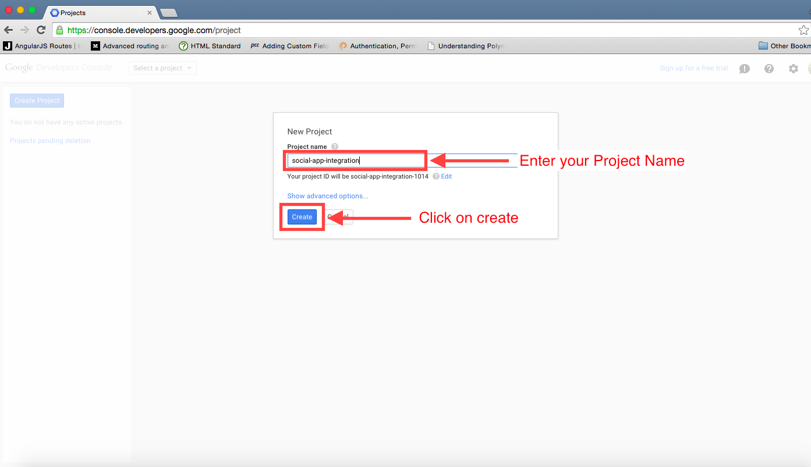
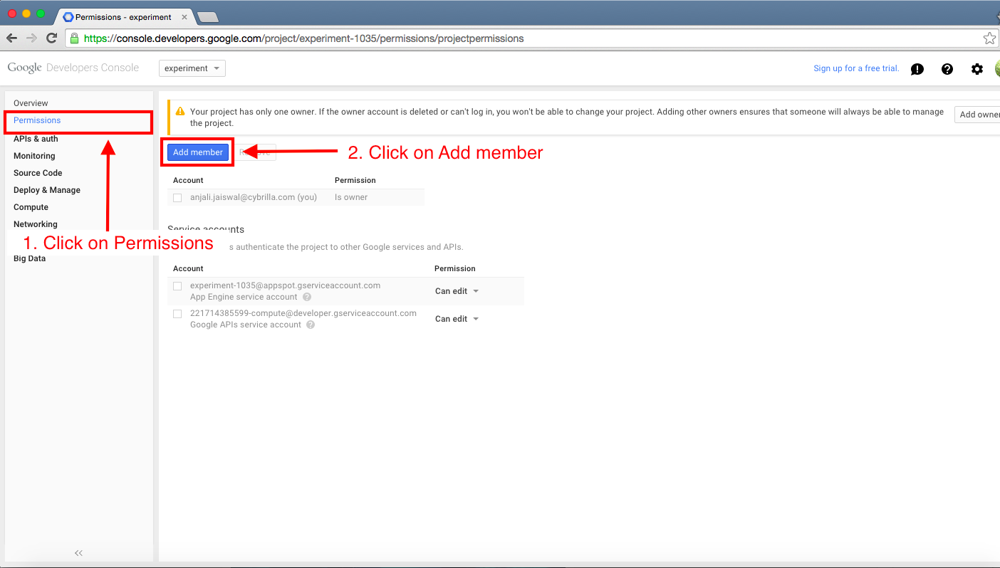
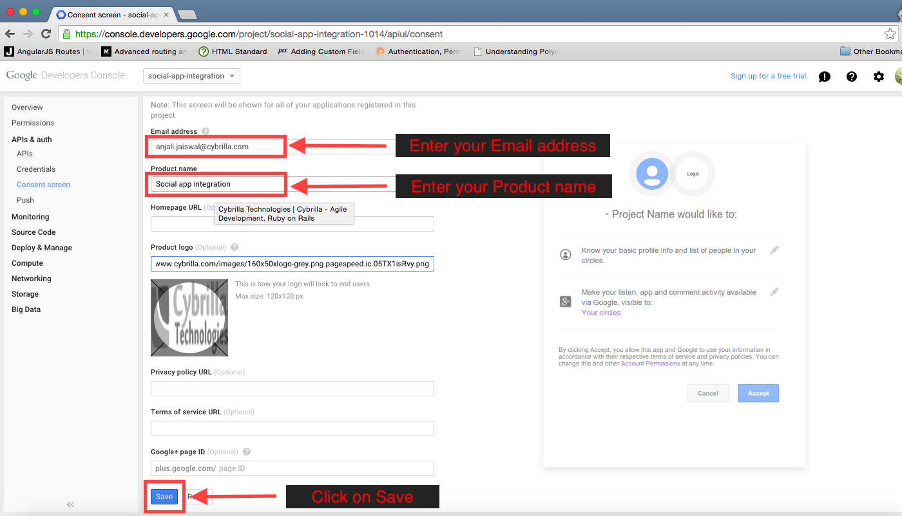
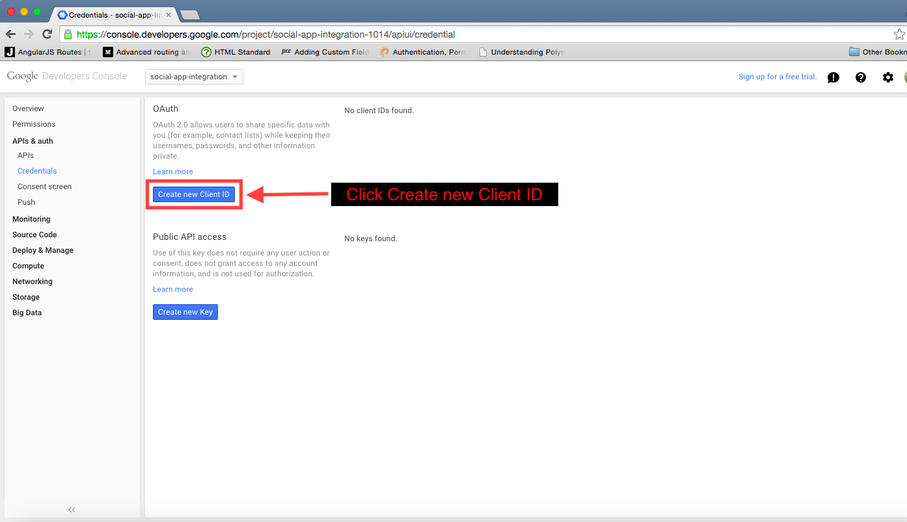
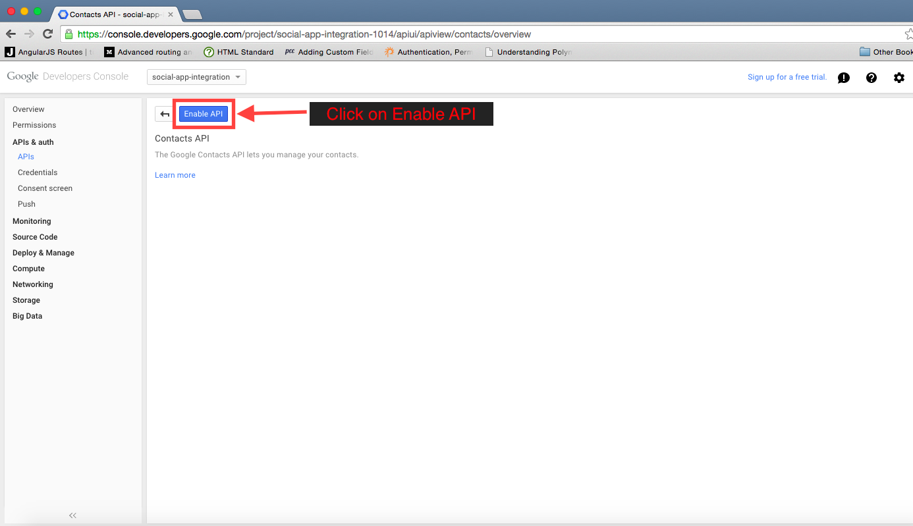
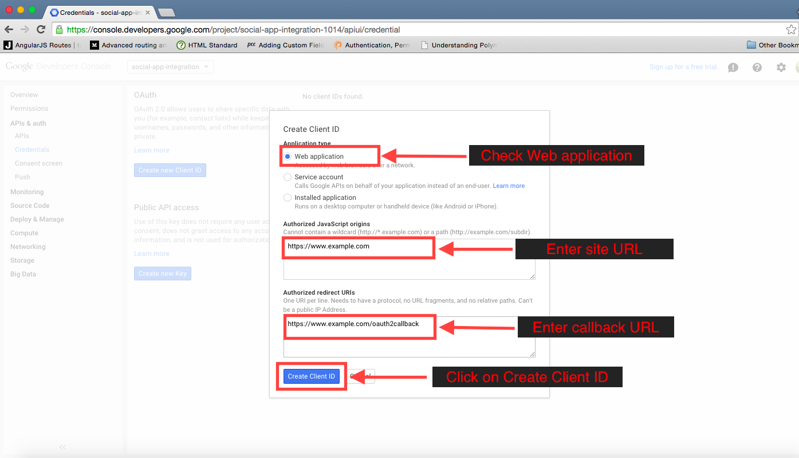
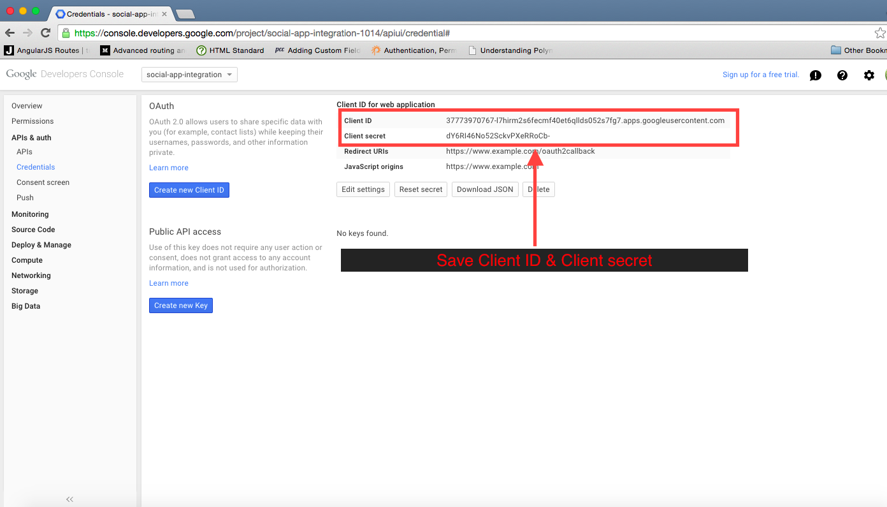

Register your app with Google:
================================

Log into your account. Then follow:

Step1 : Create an Application
-----

Step2 : Enter all details & submit
-----

If you want to give developer edit permission then follow step 3 - step 4
Else jump to step 5

Step3 : Click on Permissions
_____

Step4 : Add Member (For developer edit permission would be preferable)
_____

Step5 : Click 'APIs & auth'
-----

Step6 : Make sure "Google+ API" & "Contacts API" are on
-----

Step7 : Go to Consent Screen
-----

Step8 : Go to Credentials
-----

Step9 : Create Client Id
-----

Step10 : Save Client Id & Client Secret
-----

And finally ... 
--------------------------------------------------
Send the following details to your development team

* Client ID
* Client Secret