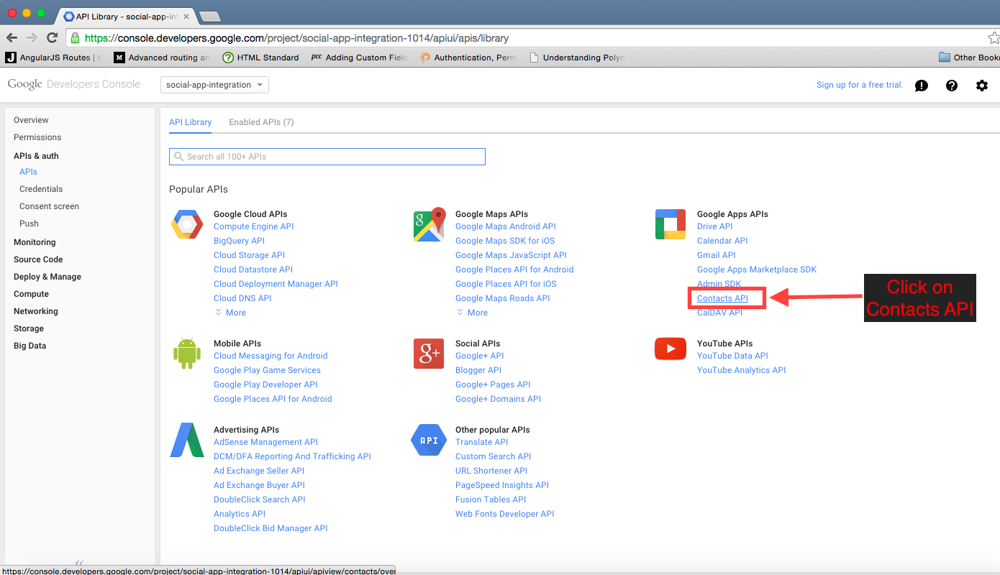

Register your app with Google:
================================

Log into your account. Then follow:

Step1 : Create an Application
-----

Step2 : Enter all details & submit
-----

Step3 : Click 'APIs & auth'
-----

Step4 : Make sure "Google+ API" & "Contacts API" are on
-----

Step5 : Go to Consent Screen
-----

Step6 : Go to Credentials
-----

Step7 : Create Client Id
-----

Step8 : Save Client Id & Client Secret
-----

And finally ... 
--------------------------------------------------
Send the following details to your development team

* Client ID
* Client Secret